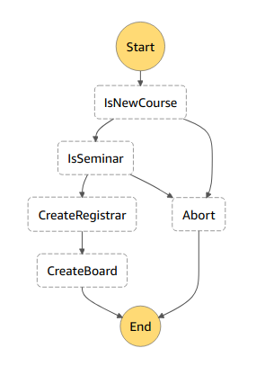

# CSYE6225 Assignment - Student Management System API

## Overview
```
Professors
     - Id - Autog-generated and Dynamo db hash key
     - professorId - DynamoDbIndexHashKey, a Global Secondary Index (GSI)
     - firstName
     - lastName
     - joiningDate
     - department

Course
     - Id (Dynamo Db generated) and hash key
     - courseId - DynamoDbIndexHashKey, a Global Secondary Index (GSI)
     - professorId
     - taId
     - department
     - boardId
     - listOfRegisteredStudents/roster - has student Id list (this is the roster)
     - notificationTopic // NEW FIELD for storing sns topic.

Board
     - Id (Dynamo Db generated) and hash key
     - boardId - DynamoDbIndexHashKey, a Global Secondary Index (GSI)
     - courseId

Announcements
     - Id (Dynamo Db generated) and hash key
     - announcementId - dynamodb Index range key part of the GSI
     - announcementText - (ensure text size is no more than 160 characters)
     - boardId -DynamoDbIndexHashKey, part of the GSI Global Secondary Index (GSI)
     - courseId - to send notification

Student
     - Id (Dynamo Db generated) and hash key
     - studentId - DynamoDbIndexHashKey, a Global Secondary Index (GSI)
     - firstName
     - lastName
     - joiningDate
     - department
     - registeredCourses - has list of registered courseIds
     - emailId - actually, it is email address

 Registrar
    - Id (Dynamo Db generated) and hash key
    - RegistrationId
    - OfferingId
    - OfferingType (Course, Counseling)
    - Department
    - PerUnitPrice (number, in USD)
```

## API
http://neu-cyse6225-student-management-system.us-east-1.elasticbeanstalk.com/webapi

  ### professor
  GET /professor  
  GET /professor/{professorId}    
  POST /professor  
  PUT /professor/{professorId}  
  DELETE /professor/{professorId}  

  ### course
  GET /course  
  GET /course/{courseId}  
  POST /course  
  PUT /course/{courseId}  
  DELETE /course/{courseId}  

  ### board
  GET /board  
  GET /board/{boardId}  
  POST /board  
  PUT /board/{boardId}  
  DELETE /board/{boardId}  

  ### announcement
  GET /announcement  
  GET /announcement/{announcementId}  
  POST /announcement  
  PUT /announcement/{announcementId}  
  DELETE /announcement/{announcementId}  

  ### student
  GET /student  
  GET /student/{studentId}  
  POST /student
  POST /  
  PUT /student/{studentId}  
  DELETE /student/{studentId}  

  ### registerOffering
  GET /registerOffering  
  GET /registerOffering/{registerOfferingId}    
  POST /registerOffering  
  PUT /registerOffering/{registerOfferingId}  
  DELETE /registerOffering/{registerOfferingId}  


## Register and receive notification with email
POST /course
```
{
    "boardId": "321",
    "courseId": "6226",
    "department": "IS",
    "professorId": "171",
    "roster": [],
    "taId": "668"
}
```

POST /student
```
{
    "department": "IS",
    "emailId": "XXX@XXX.edu",
    "firstName": "A",
    "joiningDate": "2017-10-11T20:20:11.234",
    "lastName": "BC",
    "registeredCourses": [],
    "studentId": "007"
}
```

POST /student/{studentId}/register
```
6226
```

POST /announcement
```
{
  "announcementId": "6226",
  "announcementText": "Hello World",
  "boardId": "321",
  "courseId": "6226"
}
```

## Workflow to Create Registrar and Board for Course



The Dynamodb stream for Course table will trigger a lambda.
This lambda is essentially the start of a step function workflow.

The workflows first step is to determine if the course is new and if resources need to be created for it.
A course is new if boardId, listofRegisteredStudents and it’s notificationTopic field are empty.
If the course is not new, the workflow stops.


If the department name is “Seminars”
    Your registrar should not create a record. End workflow here.

If the department name is not “Seminars”
    You will create a object in the Registrar table and continue the workflow.

If the course is not “seminars”
   you will  need to create a board object for the Course.
   Also store the boardId in the relevant Course record.

